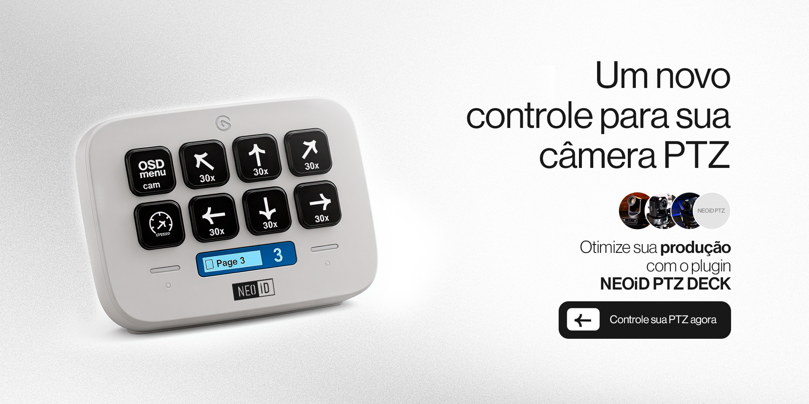

# Stream Deck PTZ Control Plugin

https://marketplace.elgato.com/product/neoid-ptz-deck-d260b006-c00d-44ae-91ec-85c0367c37df![Texto 

Este é um plugin para o **Elgato Stream Deck**, que permite criar atalhos e automações personalizadas através de botões físicos.  
Plugins do Stream Deck adicionam novas funções aos botões, permitindo controlar softwares, dispositivos ou serviços externos.

Este plugin foi desenvolvido para **controlar câmeras PTZ da NEOiD**, que são câmeras profissionais capazes de se mover em diferentes direções, ajustar zoom e foco remotamente.  
Com ele, você pode registrar várias câmeras e controlá-las diretamente pelo Stream Deck de forma simples e rápida.

---

## Funcionalidades

### Select PTZ Cameras
- Permite registrar uma ou mais câmeras PTZ.  
- É possível atribuir um nome e o IP para conexão.  
- O plugin verifica automaticamente a conectividade:  
  - Se conectado → libera os controles.  
  - Se não conectado → exibe “Not Connect”.  
- O nome da câmera aparece nos botões e em todas as ações relacionadas.  
- Suporte a múltiplas câmeras, podendo escolher qual controlar em cada botão.  
- Opção de botão toggle para abrir o **OSD Menu** da câmera.

---

### Controles Camera PTZ
- Botões configuráveis para movimento da câmera (cima, baixo, esquerda, direita etc.).  
- O nome da câmera aparece em cada botão, evitando confusão.  
- Caso a câmera não esteja conectada, o sistema usa o **cameraIP Default** (se configurado).  
- Se não houver nenhuma câmera conectada e nenhum default, aparece a mensagem **“No Camera”**.

---

### Zoom / Focus
- **Zoom**: Zoom In / Zoom Out.  
- **Focus**: Focus In / Focus Out.  
- Botão exclusivo para **Foco Automático**.  
- Ajustes rápidos e práticos.

---

### Speed
- ermite ajustar a velocidade de Pan/Tilt, Zoom e Focus.
- Cada clique no botão alterna entre os níveis de velocidade: slow → slowest → normal → fast → fastest.
- Ao atingir o último nível (fastest), o ciclo reinicia no slow (loop automático).

Também existe a ação Default Settings, que retorna todos os valores para o padrão inicial com apenas um clique.
---

### Preset
- Salva posições específicas da câmera.  
- Pressionar o botão por **2 segundos** salva a posição.  
- Um clique chama o Preset salvo.  
- Uma imagem de referência é adicionada ao botão.  
- Até **32 posições diferentes** podem ser registradas.  
- Presets são salvos por câmera selecionada.

---

### Tracking / Record / OSD Menu / Backlight
- Funções em formato **Toggle (liga/desliga)**:  
  - **Tracking** → Ativa/desativa rastreamento automático (apresentador).  
  - **Record** → Inicia/para gravação da câmera.  
  - **OSD Menu** → Abre/fecha o menu da câmera.  
  - **Backlight** → Ajusta a compensação de luz de fundo.  
